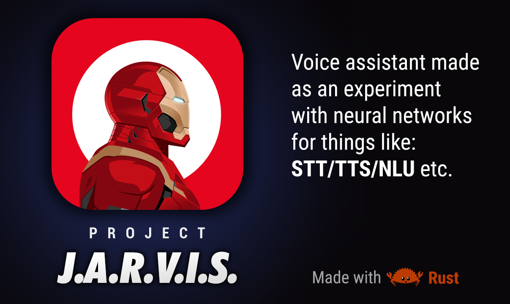

# JARVIS Voice Assistant (this readme is outdated)



`Jarvis` - is a voice assistant made as an experiment using neural networks for things like **STT/TTS/Wake Word/NLU** etc.

The main project challenges we try to achieve is:
 - 100% offline *(no cloud)*
 - Open source *(full transparency)*
 - No data collection *(we respect your privacy)*

Our backend stack is 🦀 **[Rust](https://www.rust-lang.org/)** with ❤️ **[Tauri](https://tauri.app/)**.<br>
For the frontend we use ⚡️ **[Vite](https://vitejs.dev/)** + 🛠️ **[Svelte](https://svelte.dev/)**.

*Other libraries, tools and packages can be found in source code.*

## Neural Networks

This are the neural networks we are currently using:

 - Speech-To-Text
	 - [Vosk Speech Recognition Toolkit](https://github.com/alphacep/vosk-api) via [Vosk-rs](https://github.com/Bear-03/vosk-rs)
 - Text-To-Speech
	 - [~~Silero TTS~~](https://github.com/snakers4/silero-models) *(currently not used)*
	 - [~~Coqui TTS~~](https://github.com/coqui-ai/TTS) *(currently not used)*
	 - [~~WinRT~~](https://github.com/ndarilek/tts-rs) *(currently not used)*
	 - [~gTTS~](https://github.com/nightlyistaken/tts_rust) *(currently not used)*
	 - [~~SAM~~](https://github.com/s-macke/SAM) *(currently not used)*
 - Wake Word
	 - [Rustpotter](https://github.com/GiviMAD/rustpotter) *(Partially implemented, still WIP)*
	 - [Picovoice Porcupine](https://github.com/Picovoice/porcupine) via [official SDK](https://github.com/Picovoice/porcupine#rust) *(requires API key)*
	 - [Vosk Speech Recognition Toolkit](https://github.com/alphacep/vosk-api) via [Vosk-rs](https://github.com/Bear-03/vosk-rs) *(very slow)*
	 - [~~Snowboy~~](https://github.com/Kitt-AI/snowboy) *(currently not used)*
 - NLU
	 - Nothing yet.
- Chat
	- [~~ChatGPT~~](https://chat.openai.com/) (coming soon)

## Supported Languages

Currently, only Russian language is supported.<br>
But soon, Ukranian and English will be added for the interface, wake-word detection and speech recognition.

## How to build?

Nothing special was used to build this project.<br>
You need only Rust and NodeJS installed on your system.<br>
Other than that, all you need is to install all the dependencies and then compile the code with `cargo tauri build` command.<br>
Or run dev with `cargo tauri dev`.

<br><br>
*Thought you might need some of the platform specific libraries for [PvRecorder](https://github.com/Picovoice/pvrecorder) and [Vosk](https://github.com/alphacep/vosk-api).*

### macOS

Requirements: Xcode Command Line Tools (`xcode-select --install`), [Rust](https://rustup.rs) and Node.js.
`libvosk.dylib` (universal arm64 + x86_64) is already shipped in `lib/macos`, PvRecorder brings its own dylib.

```bash
# 1. frontend dependencies
cd frontend && npm install && cd ..

# 2. build the background assistant and copy resources + libvosk.dylib next to the binary
cargo build -p jarvis-app
python3 post_build.py --sync

# 3a. run the assistant only (menu-bar icon, no window)
./target/debug/jarvis-app

# 3b. or run the GUI (it starts jarvis-app itself); run from the repository root
./frontend/node_modules/.bin/tauri dev
```

On first launch macOS will ask for microphone access - allow it, otherwise the wake-word never triggers.

## License

[Attribution-NonCommercial-ShareAlike 4.0 International](https://creativecommons.org/licenses/by-nc-sa/4.0/)<br>
See LICENSE.txt file for more details.
